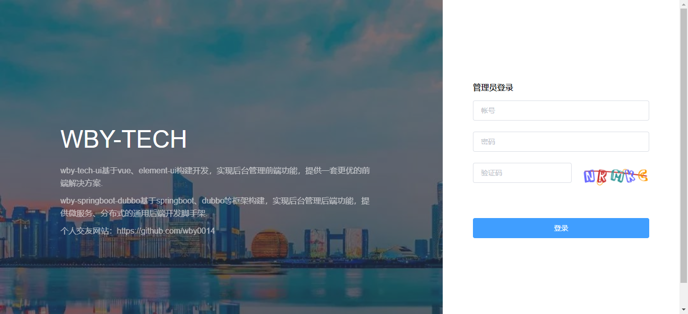
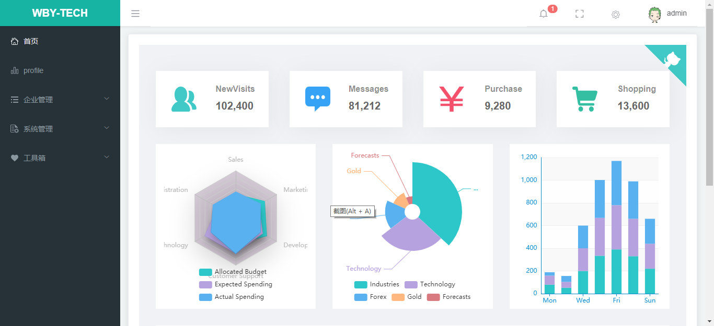
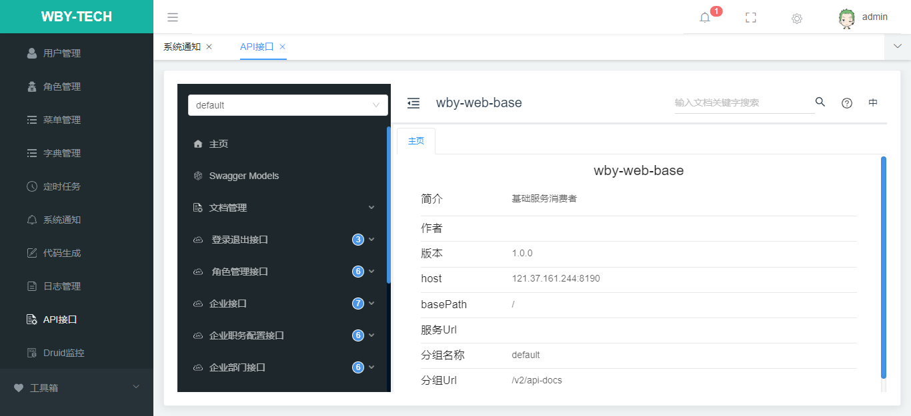
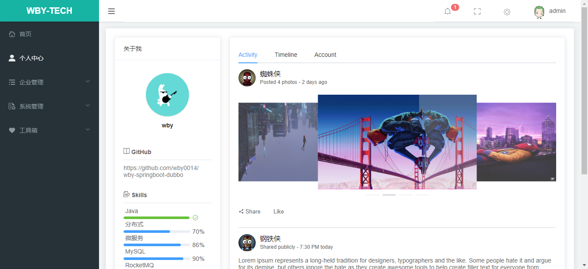

### wby-tech-ui

- wby-tech-ui基于vue、element-ui构建开发，实现后台管理前端功能，提供一套更优的前端解决方案
- 前后端分离，通过token进行数据交互，可独立部署
- 主题定制，通过sass变量统一一站式定制
- 动态菜单，通过菜单管理统一管理访问路由
- 数据切换，通过mock配置对接口数据／mock模拟数据进行切换
- 发布时，可动态配置CDN静态资源／切换新旧版本
- 演示地址：http://locahost:8090 (账号密码：admin/123456)

#### 项目地址

| 平台   | wby-springboot-dubbo（后端）                    | wby-tech-ui（前端）                                          |
| ------ | ----------------------------------------------- | ------------------------------------------------------------ |
| GitHub | https://github.com/wby0014/wby-springboot-dubbo | [https://github.com/wby0014/wby-tech-ui](https://github.com/wby0014/wby-tech-ui) |


#### 前端启动

    1. 安装淘宝NPM镜像
    npm install -g cnpm --registry=https://registry.npm.taobao.org
    npm config set registry  https://registry.npm.taobao.org
    2. 运行
    cnpm install
    npm run dev
    访问 http://localhost:8090

#### 打包部署

 ```bush
 npm run build  --正式环境
 npm run build -test --测试环境
 ```

#### 系统预览

<table>
  <tr>
     <td></td>
     <td></td>
  </tr>
  <tr>
     <td></td>
     <td></td>
  </tr>
</table>


#### 赞赏


#### 更新日志

+ v1.0.0
 + 代码优化